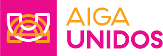
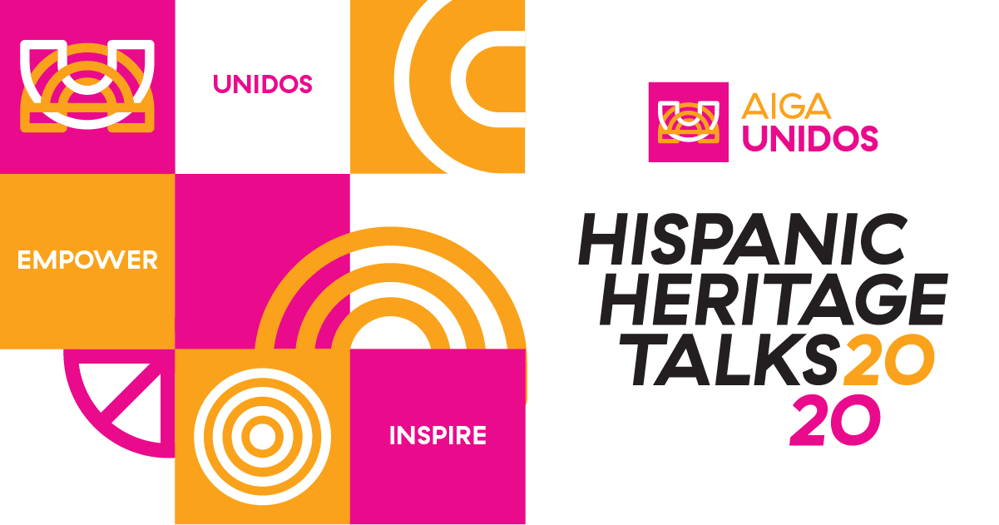

# AIGA Unidos 

[AIGA Unidos](https://aigaunidos.com/), a multi-chapter collaboration, creating a space to empower and celebrate the lives, work, stories, and needs of creatives with a Latinx and Hispanic cultural heritage.

------

Una colaboración entre secciones (chapters), creando un espacio en el cual se pueda empoderar y celebrar las vidas, los trabajos, las historias, y las voces de las personas creativas con herencia cultural Latinx e Hispana.

## Hispanic Heritage Talks

**September 15th - October 15th**

AIGA Unidos was created for Everyone!
We highlight Hispanic and Latinx creatives, so we can share their stories and work with the world—that’s you! Our first ever event is a series of talks called Hispanic Heritage Talks, which will take place during Hispanic Heritage Month. It is a series of virtual talks featuring Latinx and Hispanic creatives from different backgrounds and disciplines. ¡Acompañanos!

Join the AIGA Unidos familia, and hear from all the amazing creatives our heritage has to offer. From us to you, with love and a little sazón... who are we kidding? A lot of sazón! *We are Unidos for Everyone!*